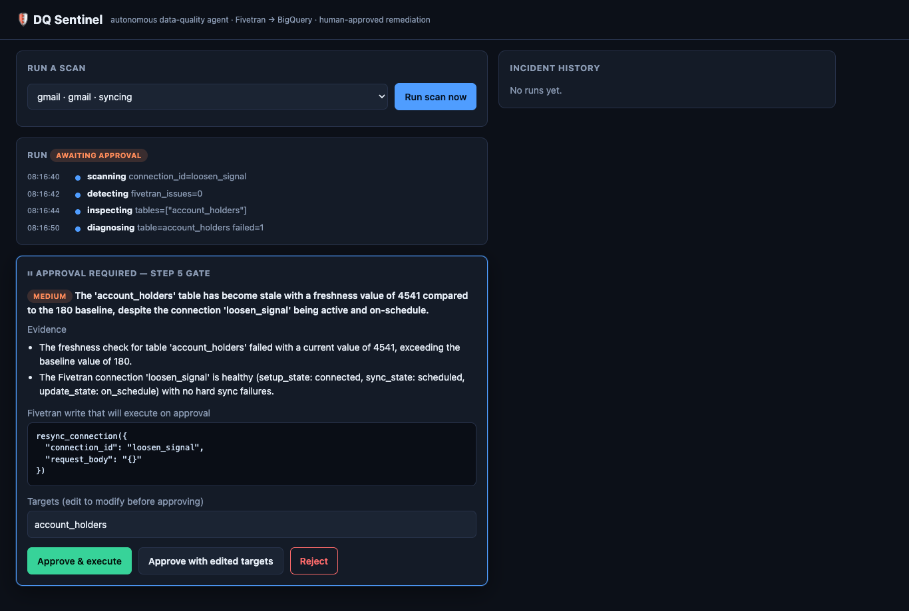

# DQ Sentinel

[](LICENSE)

An autonomous data-quality agent for financial-services data lakes. Watches Fivetran pipelines feeding daily regulatory reports, diagnoses root cause with Gemini, and proposes remediations through Fivetran's MCP server — with a human approval gate before any write. Built so the data engineer doesn't get paged at 3am for a sync miss that would silently break the morning compliance report.

Demo narrative: "Greedy Bank" — a fictional mid-tier Australian bank whose APRA reporting depends on overnight Fivetran syncs.

Built for the **[Google Cloud Rapid Agent Hackathon](https://rapid-agent.devpost.com/) — Fivetran track**. Deadline: 2026-06-11.

## Status

The 7-step agent loop (scan → detect → inspect → diagnose → **approve** → act → verify) and the web UI are built and deployed to Cloud Run. Architecture and capability specs are version-controlled under [`openspec/`](openspec/); the authoritative product spec is [`docs/PRD.md`](docs/PRD.md).

- Hosted URL: https://dq-sentinel-sjsibsau7a-uc.a.run.app
- Demo video: _coming week 4_

Run locally: `uv run uvicorn dq_sentinel.web.app:app` (needs `FIVETRAN_API_KEY`/`FIVETRAN_API_SECRET` + Vertex env). Deploy: `./deploy.sh`.



> The agent pauses at step 5 and shows the **exact** Fivetran write it wants to run — severity, root cause, evidence, and the precise MCP call — and waits for approve / reject / edit. No pipeline write happens until you click.

**Demo:** deck ([`docs/demo/slides.html`](docs/demo/slides.html)) · 3-min recording script ([`docs/demo/DEMO_SCRIPT.md`](docs/demo/DEMO_SCRIPT.md)) · video ([`docs/demo/dq-sentinel-demo.mp4`](docs/demo/dq-sentinel-demo.mp4)) · Devpost writeup ([`docs/demo/DEVPOST.md`](docs/demo/DEVPOST.md)).

## What it does

1. **SCAN** every Fivetran connection via MCP.
2. **DETECT** sync failures, schema drift, sync delays.
3. **INSPECT** flagged tables with parameterized BigQuery checks (row count, null rate, freshness).
4. **DIAGNOSE** with Gemini, correlating pipeline metadata + DQ signals into a ranked root-cause hypothesis.
5. **RECOMMEND + APPROVE** — the human gate. The model proposes a tool call; you click approve.
6. **ACT** via Fivetran MCP write tools (`sync_connection`, `resync_tables`, `reload_schema`).
7. **VERIFY** — re-run failed checks, emit incident report with before/after metrics and TTR.

## How the approval gate stays unbypassable

The diagnosis model is given exactly one tool — `propose_remediation` — and **zero** Fivetran write tools. The write path (`dq_sentinel/act.py`) runs in application code that is only reachable *after* a human approves. Over HTTP the gate is bridged with an `asyncio.Future`: a run is a detached `asyncio` task, its `approval` callback parks on a Future, and `POST /api/runs/{id}/decision` resolves it — so no request thread is held across the human wait or the multi-minute verify poll. Verified by tests (`scripts/test_web_gate.py`, `scripts/test_web_http.py`) and a 23-agent adversarial review (0 blockers).

## Stack

- Orchestration: Google ADK (Agent Builder, code-first) on Cloud Run
- LLM: Gemini 3.5 Flash on Vertex AI (served from `global`; model ID swappable in `dq_sentinel/config.py`)
- Pipeline I/O: [fivetran/fivetran-mcp](https://github.com/fivetran/fivetran-mcp) over stdio (read tools to the model; write tools to app code only)
- Data warehouse: BigQuery via the Python client — templated SQL, allowlist + `INFORMATION_SCHEMA` validation, no free-form SQL
- Web: FastAPI + an `asyncio.Future` approval bridge + a thin polling UI
- Demo source: Google Sheets → Fivetran → BigQuery
- Hosting: Cloud Run (`./deploy.sh` bakes the load-bearing flags)

## Repository layout

```
dq_sentinel/                 The agent
  config.py                  Model ID, MCP command, thresholds (all swappable)
  agent.py                   ADK McpToolset factories (read vs write split)
  bq.py                      BigQuery DQ checks + baseline storage (templated SQL)
  diagnose.py                Gemini DIAGNOSE step + propose_remediation contract
  act.py                     Step 6 — approved proposal → one Fivetran write
  verify.py                  Step 7 — poll sync, re-run checks, before/after + TTR
  mcp_client.py              Direct Fivetran MCP client for app code (no LLM)
  loop.py                    The 7-step orchestration + incident report
  web/                       FastAPI app, asyncio.Future approval bridge, polling UI
scripts/                     Run + test scripts (test_loop, test_web_gate, test_web_http, ...)
Dockerfile, deploy.sh        Cloud Run deploy (pre-baked MCP, load-bearing flags)
docs/PRD.md                  Product requirements (source of truth)
docs/demo/                   Deck, recording script, screenshots, demo video, Devpost writeup
openspec/                    Versioned architecture + capability specs
demo-data/                   Seeded Greedy Bank demo data (3 clean + 5 pre-broken CSVs)
LICENSE                      Apache-2.0
```

## Demo data

Reproducible Greedy Bank dataset (3 sheets, ~2,600 rows, AUD).

```bash
uv run demo-data/generate.py
```

Produces 3 clean CSVs (`account_holders`, `transactions`, `loan_products`) plus 5 pre-broken variants matching the break scenarios in PRD §8 (null-injection, duplicates, data-loss, distribution-shift, schema-rename). Seeded — same output every run.

## License

Apache License 2.0 — see [LICENSE](LICENSE).
